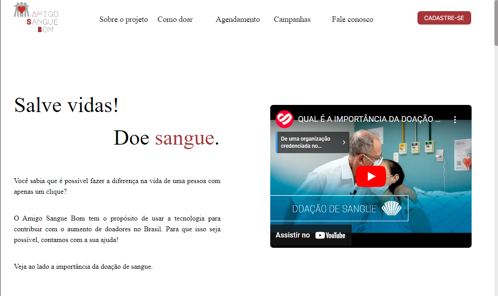
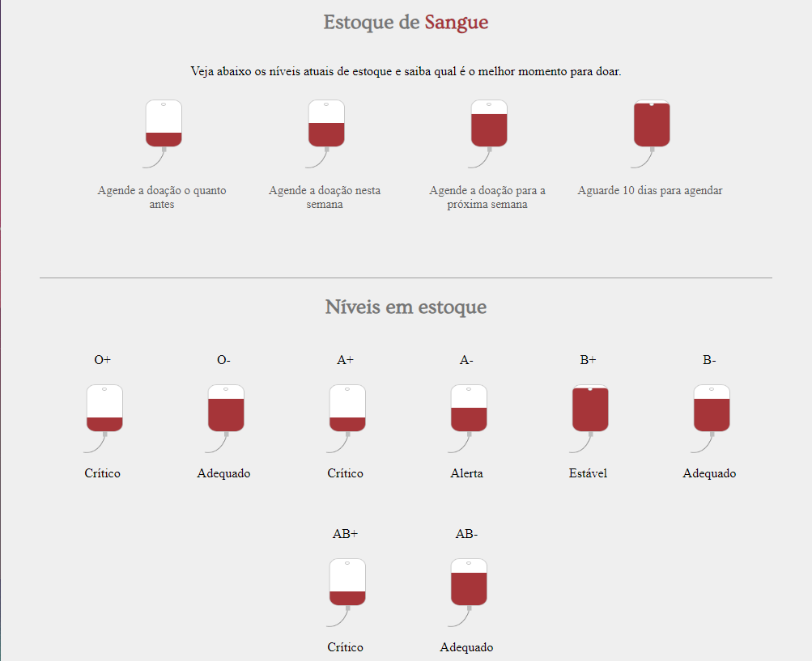
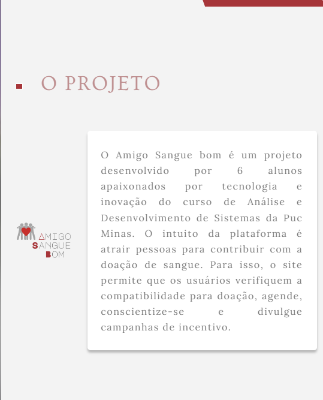
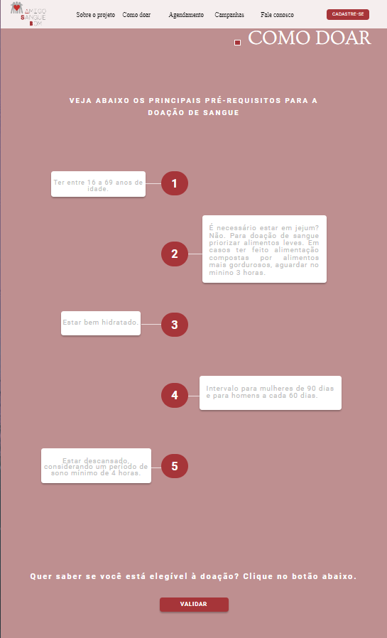
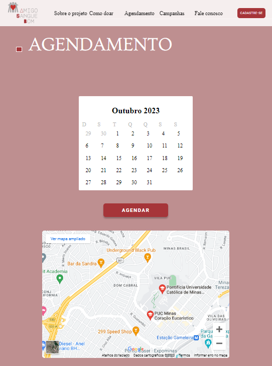
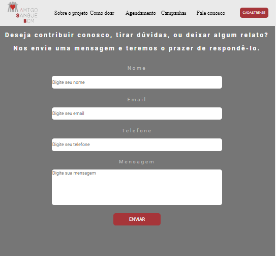
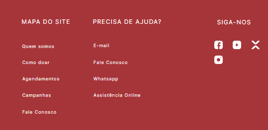

# Template padrão da Aplicação

O template padrão do site e suas áreas estáticas foram desenvolvidas através das linguagens de marcação; HTML e CSS. Quanto ao dinamismo dos botões e modais, utilizou-se a linguagem de programação Javascript.

Os elementos padrões da aplicação serão: 
- Header: menu de navegação do usuário;
- Main: contem as principais informações do projeto;
- Sections: compreende os requisitos para doação e agendamento;
- Asides: área de publicações referentes à doação de sangue;
- Footer;

Enquanto elementos de identidade visual, tem-se:

* Cores:

| Cor             | Hex                                                                |
| ----------------- | ------------------------------------------------------------------ |
| Cor primária |  #A63539 |
| Cor secundária |  #FBB6B6 |
| Cor terciária |  #BE8F90 |

* Font-family: Inter, Sans-serif, Ovo e Lora;
* Font-size: 1.0rem e 1.5 rem

O código desenvolvido para a construção dos elementos anteriormente mencionados estão disponíveis [clicando aqui](https://github.com/ICEI-PUC-Minas-PMV-ADS/Amigo-Sangue-Bom/tree/main/codigo-fonte).

## Logotipo 

Para criação do logotipo utilizou-se as cores que remetem à sangue e ao fundo um grupo de pessoas abraçadas fazendo referência à união.

## Tela principal de conscientização

Exibe informações relativas à conscientização sobre a doação de sangue e um vídeo para incentivar os usuários 

## Tela de Estoque e Níveis de Sangue

Exibe para o usuário informações sobre os níveis atuais de estoque de sangue e orientações para que saiba o melhor momento para doar.

## Tela Sobre o Projeto

Exibe o objetivo do projeto.

## Tela de Requisitos para Doação

Exibe um diagrama simples com os principais recomendações para a doação de sangue e um botão onde é possível fazer validações.

## Tela para Agendamento

Exibe um calendário e um botão que direciona o usuário para efetivar a doação de sangue.

## Tela de Campanhas e Publicações

Exibe campanhas de conscientização sobre a doação de sangue.

## Tela de Fale Conosco

Exibe tela onde o usuário pode tirar dúvidas, enviar relatos e sugestões.

## Tela de Footer
Exibe o rodapé da página 

