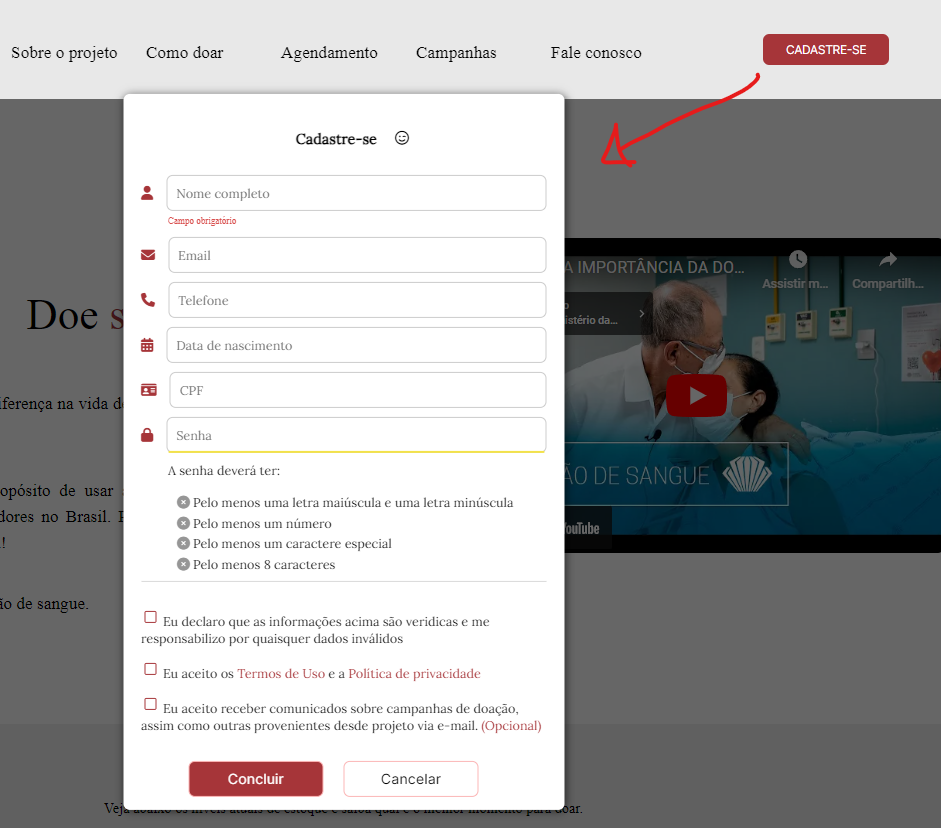

# Programação de Funcionalidades

## Área de Cadastro (RF-001)

#### Responsável: Erick, Douglas e Mateus

O acesso à tela de cadastro poderá ser feita através da opção no menu principal em "Cadastre-se". As estruturas de dados foram baseadas em HTML, CSS e JS.

Exemplo da tela de cadastro:

Requisito atendido

RF-001: O sistema deve permitir que o usuário faça um cadastro.

#### Artefatos da funcionalidade

* index.html
* index.css
* index.js

#### Estrutura de Dados

* index.html

#### Instruções de acesso

Abra um navegador de Internet e informe a seguinte URL: https://brianmduarte.github.io/Amigo_Sangue_Bom/

Ao cliclar em "Cadastre-se" no canto superior direito, um modal será aberto na mesma página para efetuar o cadastro.

## Tela de Triagem (RF-02)

Requisito em desenvolvimento...

## Tela de Campanhas e Publicações (RF-003)

#### Responsável: Brian

O acesso poderá ser feito através do menu de navegação na parte superior do site ao clicar em "Campanhas".

Exemplo da área de Campanhas:

Requisito atendido

RF-003: O sistema deve fornecer informações sobre a importância e os benefícios da doação de sangue.

#### Artefatos da funcionalidade

* index.html
* index.css
* index.js

#### Estrutura de Dados

* index.html

#### Instruções de acesso

Abra um navegador de Internet e informe a seguinte URL: https://brianmduarte.github.io/Amigo_Sangue_Bom/

Ao cliclar em "Campanhas" no menu de navegação, o usuário será direcionado para a seção correspondente.

## Tela de Estoque e Níveis de Sangue (RF-004)

#### Responsável: Brian e Erick

O acesso à tela de níveis de estoque de sangue está contida na primeira seção do site e poderá ser acessada clicando sobre a Logo do site. 

Exemplo da Tela de Estoque:

Requisito atendido

RF-004: O sistema deve mostrar a quantidade de cada tipo sanguíneo disponível.

#### Artefatos da funcionalidade

* index.html
* index.css
* index.js

#### Instruções de acesso

Abra um navegador de Internet e informe a seguinte URL: https://brianmduarte.github.io/Amigo_Sangue_Bom/

Ao cliclar em sobre o ícone da "Logo Amigo Sangue Bom" no menu de navegação, o usuário será direcionado para a seção correspondente.

## Tela de Visualização de Cadastros. (RF-005)

RF-005: O sistema deve permitir que enfermeiros visualizem os cadastros de doadores para planejar consultas e coletas de sangue

Requisito em desenvolvimento...

## Tela de Envio de e-mails (RF-006)

RF-007: O sistema deve permitir que enfermeiros enviem e-mails aos doadores cadastrados para informar sobre imprevistos ou atualizações.

Requisito em desenvolvimento...

## Tela de Campanhas e Publicações. (RF-007) 

#### Responsável: Ranan e Luiz

O acesso poderá ser feito através do menu de navegação na parte superior do site ao clicar em "Campanhas".

Exemplo da área de Campanhas:

Requisito atendido

RF-007: O sistema deve permitir que usuários compartilhem informações educativas sobre doação de sangue em suas redes sociais

#### Artefatos da funcionalidade

* index.html
* index.css
* index.js

#### Estrutura de Dados

* index.html

#### Instruções de acesso

Abra um navegador de Internet e informe a seguinte URL: https://brianmduarte.github.io/Amigo_Sangue_Bom/

Ao cliclar em "Campanhas" no menu de navegação, o usuário será direcionado para a seção correspondente.

